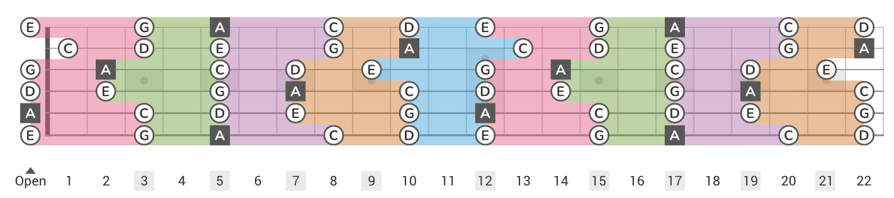

# Guitar Fretboard Visualizer

An interactive fretboard visualization for the pentatonic scales, built in Elm.
Pick any root note, toggle between major and minor pentatonic, and see all five
"boxes" (positions) laid out across the neck with each box shaded its own
color — matching the style of `fretboard-reference.jpeg`.



## Features

- **22-fret, 6-string** diagram with standard tuning (E A D G B E), high E on
  top to match the reference image.
- **12 root notes** (C, C#, D, ..., B) selectable with one click.
- **Major / Minor pentatonic** toggle. Major pentatonic uses the same shapes
  as its relative minor, so the five boxes slide together as you change scale.
- **Five colored box regions** drawn as translucent polygons, matching the
  reference:
  - Box 1 — purple
  - Box 2 — orange
  - Box 3 — blue
  - Box 4 — pink
  - Box 5 — green
- **Note names printed on every scale tone**, with the root shown in a dark
  square and every other note in a white circle.
- **Fret markers** at 3, 5, 7, 9, 12 (double), 15, 17, 19, 21 and fret numbers
  labeled below the neck.

## Running it

Requires [Elm 0.19.1](https://guide.elm-lang.org/install/elm.html).

```sh
# Compile
elm make src/Main.elm --output=elm.js

# Serve (any static server works — e.g. Python's built-in)
python3 -m http.server 8000
# then open http://localhost:8000
```

Or just open `index.html` directly in your browser after compiling
(modern browsers will load `elm.js` from the same folder with no server).

## How the boxes are computed

The minor pentatonic has one 5-note pattern that repeats every 12 frets, and
which can be carved into five connected "boxes" — each box containing the two
scale notes on each string within a small fret range. Because the B string is
tuned a major third above G (not a perfect fourth like the others), the
shapes shift by one fret across the G–B boundary.

Each scale note on the board is assigned to the box where it serves as the
*lower* of the two notes on its string. This gives every note a unique
primary box (and color). Adjacent boxes share a boundary: the upper note of
box N on a given string is also the lower note of box N+1 on that same
string.

Major pentatonic is drawn by treating it as the relative minor (root − 3
semitones): same shapes, same colors, just a different note highlighted as
the root. So e.g. **C major pentatonic** and **A minor pentatonic** render
with identical box positions, only the dark "root" square moves.

## Files

- `src/Main.elm` — the whole app (model, scale math, SVG rendering).
- `index.html` — host page; loads `elm.js`.
- `elm.json` — Elm package manifest.
- `fretboard-reference.jpeg` — the reference image this visualization is
  modeled after.
